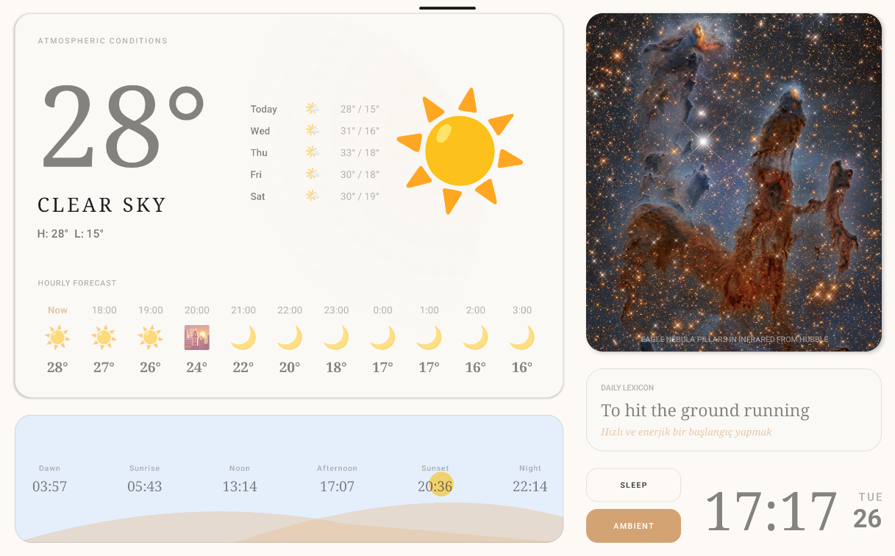
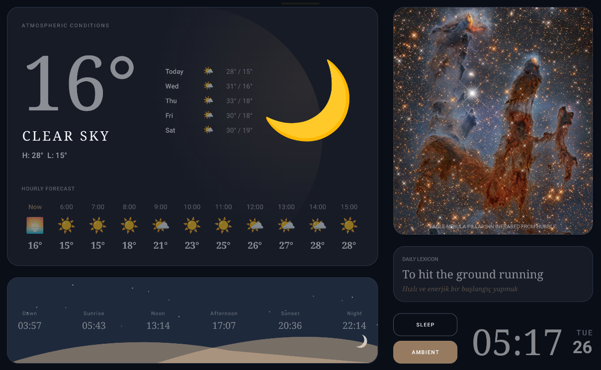

# Hanem Dashboard 🌓🏠

[](https://kotlinlang.org)
[](https://developer.android.com/jetpack/compose)
[](https://android.com)
[](https://developer.android.com/topic/architecture)

**Transform legacy hardware into an industrial-grade "Living Canvas."**

Hanem is a high-fidelity, highly resilient Smart Home Dashboard designed specifically for permanent, wall-mounted kiosk installations. While most ambient displays are dangerous for long-term hardware health, Hanem is engineered from the sub-pixel level up to solve the physical limitations of legacy IPS and OLED panels, all while operating completely autonomously.

---

## 🖼️ Visual Experience & Interface Modules

| Landscape Perspective | Night / Deep Sleep |
| :---: | :---: |
|  |  |

### Core Dashboard Modules:
1. **The Weather King**: A massive, typography-heavy atmospheric display. It features a reactive, 10-hour sliding window forecast that constantly shifts based on the current hour, alongside a 5-day predictive layout.
2. **Astro-Dune Celestial Tracker**: A custom mathematical `Canvas` that renders the sun and moon on a **Quadratic Bezier Path**. The landscape dynamically shifts based on exact local dawn, noon, and sunset data.
3. **Daily Digital Art (NASA APOD)**: Fetches the Astronomy Picture of the Day. It includes a smart fallback mechanism and video-filtering to ensure the aesthetic of the frame is never broken.
4. **English Lexicon**: An idempotent daily vocabulary cache that locks to your local calendar, providing exactly one curated phrase per 24-hour cycle.
5. **Ultra-Minimal Ambient Mode**: A secondary, distraction-free state designed for pure aesthetics. With a single tap, the detailed telemetry fades away, leaving only a hyper-minimalist digital art frame and a subtle clock. Perfect for serving as a passive room accent while maintaining full Zero-Static pixel protection.

---

## 🛡️ The Hardware Problem: "Zero-Static" Defense

Standard Android UI is "static-deadly." Running an app 24/7 on an older tablet causes permanent sub-pixel degradation (Burn-in) and liquid crystal fatigue. Hanem solves this through a **Mathematical Motion Engine** that ensures no single pixel remains in the same state for more than 45 seconds.

* **The Macro-Shift (4-Point Rotation)**: The entire UI container is bound to a deterministic, sequential rotation engine. Every 45 seconds, the layout performs a micro-shift: `(1,1) → (-1,1) → (-1,-1) → (1,-1)`. This ±1dp movement is visually invisible but guarantees that every high-contrast edge physically moves across different sub-pixels.
* **MicroScale "Breathing"**: For high-contrast elements (like NASA space imagery), static bright pixels can cause image retention. Hanem implements a slow, continuous scale loop from `1.0f` to `1.02f` over 45 seconds, ensuring sharp edges (like stars) never stress the same liquid crystals constantly.
* **Surface Tone Oscillation**: To prevent OLED voltage fatigue, a 5-minute background heartbeat silently oscillates card surfaces between light/dark tones, keeping RGB voltage values constantly in flux.

---

## ⚡ The "Silver Bullet" API & Data Architecture

Hanem is built for 24/7 uptime in environments with unstable internet. The data flow is designed to be **unbreakable**, executing precisely timed fetch schedules:

### Fetch Scheduling Logic:
* **`00:00` (Midnight Crossing)**: The heartbeat radar detects the day-rollover. It instantly invalidates the cache and fetches fresh **Weather** and **Prayer/Astro** data to ensure dawn and sunrise calculations are perfectly accurate before morning.
* **`08:00` (Morning Sync)**: The primary WorkManager sync fires. It fetches the latest **Weather**, **NASA APOD** (which usually updates on US time), and the daily **Lexicon** phrase.
* **`17:00` (Evening Transition)**: A secondary Weather sync fires to guarantee the 10-hour sliding window has the most accurate data for the transition into the night.

### Resilience Mechanisms:
* **Date-Aware Cache Validation**: The app treats the SQLite (Room) database as the single source of truth. It only triggers network requests if today's calendar date mismatches the database's `lastUpdated` timestamp.
* **Reactive Network Recovery**: Built on `ConnectivityManager.NetworkCallback`. If the tablet drops offline during a scheduled update (e.g., at 08:00), the UI displays cached data without crashing. The exact millisecond the Wi-Fi returns, a Flow observer triggers a silent background catch-up.
* **API Debounce Shield**: A strict 15-minute software throttle blocks "Hammering" during network instability, protecting your IP from API rate-limit bans.

---

## ⚙️ Developer Configuration (Action Required)

To run Hanem accurately in your own home, you **must** hardcode your specific geographical coordinates and API keys into the project before building.

1.  **Weather Coordinates**: Open `WeatherRepository.kt` and `DailyUpdateWorker.kt` (or your specific Worker class) and replace the default coordinates with your local latitude and longitude.
    ```kotlin
    // Example: Replace with your Latitude and Longitude
    weatherRepository.refreshWeather(lat = 38.4237, lon = 27.1428) 
    ```
2.  **Celestial / Prayer Location**: Open `PrayerApiService.kt` (or your Prayer Repository) and update the parameters to your exact Country and City so the Astro-Dune canvas calculates the sun's trajectory correctly.
    ```kotlin
    // Example: Replace with your Country and City
    @Query("city") city: String = "Izmir",
    @Query("country") country: String = "Turkey"
    ```
3.  **API Keys**: Ensure you have valid keys for OpenWeatherMap and NASA APOD, inserted securely via your `local.properties` or Build Config.

---

## 🛠️ True Kiosk: Hardware Setup Guide

Hanem is designed to turn a general-purpose tablet into a specialized appliance. For the best 24/7 experience, configure your tablet with these hardware-level settings:

1.  **Screen Timeout to "Never"**: Go to your tablet's *Settings -> Display -> Screen Timeout* (or Sleep) and set it to **"Never"** (or the maximum allowed duration). This ensures the dashboard remains visible indefinitely without requiring any touch interaction.
2.  **Stay Awake**: Enable Developer Options on your tablet and toggle **"Stay Awake"** (Screen will never sleep while charging) as an extra layer of protection against the OS suspending the screen.
3.  **The "Hardware Lung" Strategy (Battery Management)**:
    * **Do NOT leave the tablet charging 24/7.** Constant voltage will cause the lithium-ion battery to bloat and destroy the screen from the inside.
    * **Smart Plug Setup**: Use a cheap smart plug timer to cycle the battery. *Example Setup:* Run the screen from 08:00 to 23:00. Set the smart plug to charge for only 2 hours in the morning and 2 hours in the evening.
    * *Tip:* Observe your specific tablet's battery drain and adjust the smart plug schedule to keep the battery level oscillating roughly between 20% and 80%.

---

## 🏗️ Technical Stack

* **UI**: 100% Jetpack Compose (Declarative Graphics, Custom Canvas, Animation APIs)
* **Architecture**: MVVM + Clean Architecture with Repository Pattern
* **DI**: Hilt (Dependency Injection)
* **Concurrency**: Kotlin Coroutines & Flow (Reactive Data Streams)
* **Persistence**: Room Database (Offline-First approach with destructive migration fallback)
* **Networking**: Retrofit + OkHttp (Custom Logging & Interceptors)
* **Background Tasks**: WorkManager (Scheduled daily updates & idempotent retries)
* **Image Loading**: Coil (with HD URI permission persistence)

---

## ⚖️ License
Project developed for professional portfolio demonstration. All rights reserved.